# Full Signup + Webhook Diagram

This is a full diagram set for the current signup system and the target single-student model.

Relevant files:

- [signup.html](/Users/julian/Documents/Projects/Business/liveoakjiujitsu/signup.html:505)
- [voice-signup.html](/Users/julian/Documents/Projects/Business/liveoakjiujitsu/voice-signup.html:574)
- [agent/ghl-setup-guide.md](/Users/julian/Documents/Projects/Business/liveoakjiujitsu/agent/ghl-setup-guide.md:55)
- [agent/ghl-custom-fields.md](/Users/julian/Documents/Projects/Business/liveoakjiujitsu/agent/ghl-custom-fields.md:1)

---

## 1. Full Current System

Two public pages feed two different webhook endpoints:

- `/signup` -> website webhook
- `/voice-signup` -> voice-agent webhook

Both pages currently allow multi-person registration.

### 1.1 Current System Map

```mermaid
flowchart TD
    A[Prospect] --> B{Entry point}

    B --> C[/signup]
    B --> D[/voice-signup]

    C --> E[Website signup form]
    D --> F[Voice-agent signup form]

    E --> G{Mode}
    F --> H{Mode}

    G --> G1[Just Me]
    G --> G2[My Child / Someone Else]
    G --> G3[Me + Others]

    H --> H1[Just Me]
    H --> H2[My Child / Someone Else]
    H --> H3[Me + Others]

    G1 --> I[Build JSON payload]
    G2 --> I
    G3 --> I
    H1 --> J[Build JSON payload]
    H2 --> J
    H3 --> J

    I --> K[Website webhook]
    J --> L[Voice webhook]

    K --> M[GoHighLevel workflow]
    L --> N[GoHighLevel workflow]

    M --> O[Create Contact]
    N --> P[Create Contact]

    O --> Q[Store custom fields]
    P --> R[Store custom fields]

    Q --> S[Book appointment from person_1 only]
    R --> T[Book appointment from person_1 only]
```

### 1.2 Current Page Logic

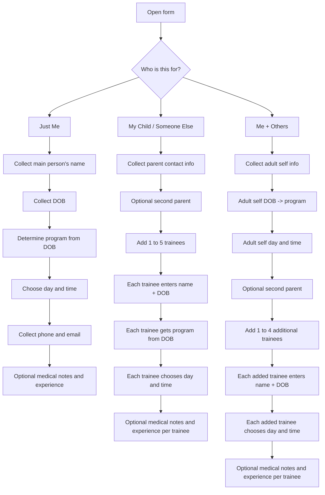

### 1.3 Current Website Signup Payload

`/signup` currently works like this:

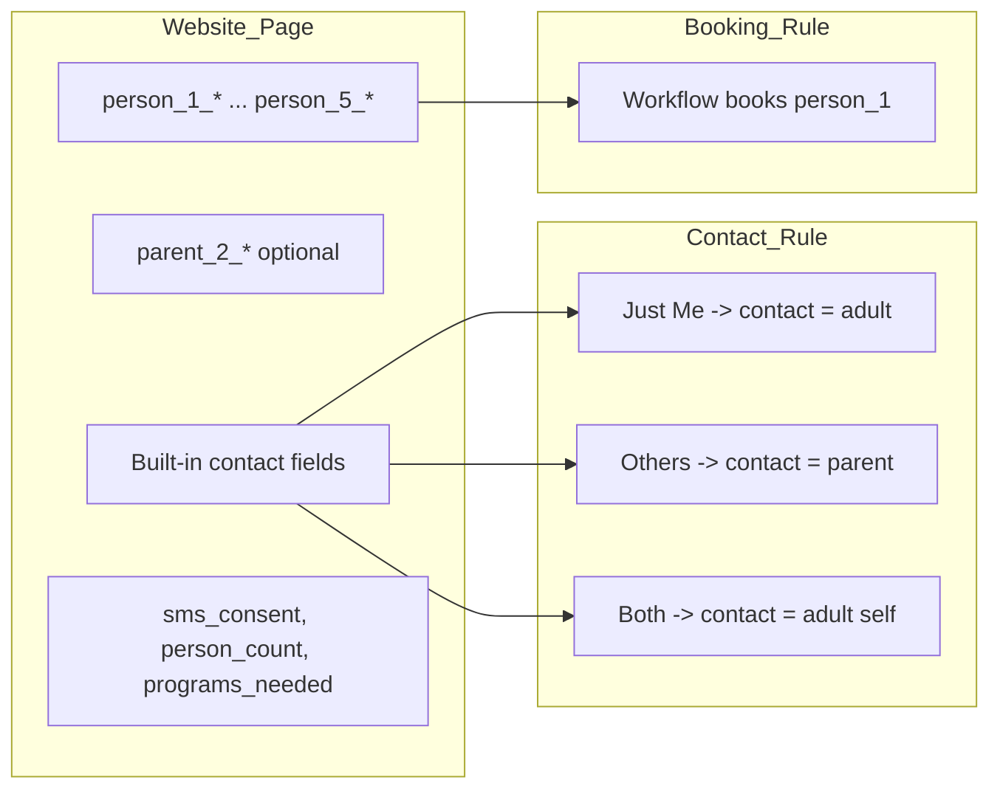

### 1.4 Current Voice Signup Payload

`/voice-signup` is the same structure, but also includes emergency-contact behavior.

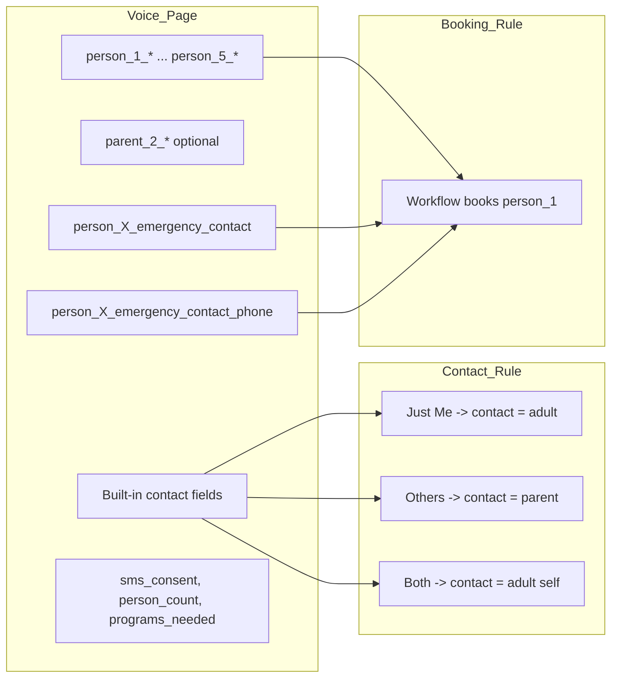

### 1.5 Current Identity Mismatch

This is the part that makes the current model confusing.

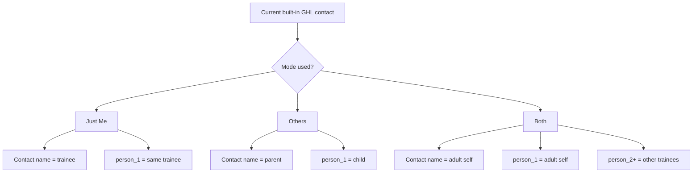

The bad branch is `Others`:

- built-in contact record belongs to the parent
- booking logic belongs to `person_1`
- the trainee and the contact are not the same person

---

## 2. Current Field Ownership

### 2.1 Current Data Model

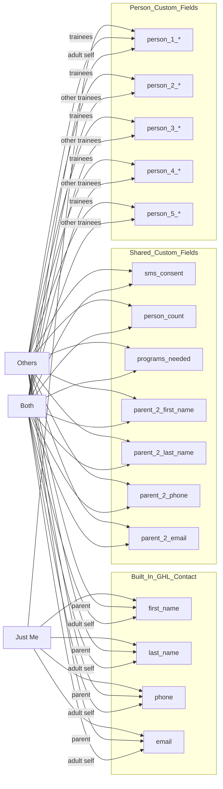

### 2.2 Current Appointment Booking

From [ghl-setup-guide.md](/Users/julian/Documents/Projects/Business/liveoakjiujitsu/agent/ghl-setup-guide.md:55), the workflow books by `person_1_program` and `person_1_appointment_datetime`.

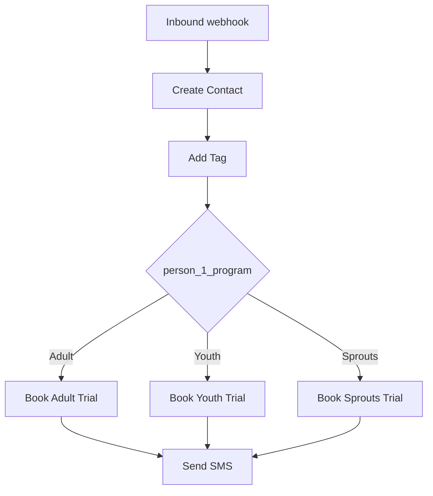

That is why `person_1` is the most important object in the payload.

---

## 3. Proposed Full Target System

New business rule:

- one submission = one student account
- remove multi-person registration from both `/signup` and `/voice-signup`
- the account name should always be the student
- if the student is a child, parent contact info should still be attached to that student account

That means both pages should use the same two-mode model:

- `self`
- `parent-for-child`

### 3.1 Proposed System Map

```mermaid
flowchart TD
    A[Prospect] --> B{Entry point}

    B --> C[/signup]
    B --> D[/voice-signup]

    C --> E[Single-student signup form]
    D --> F[Single-student voice signup form]

    E --> G{Who is training?}
    F --> H{Who is training?}

    G --> G1[Myself]
    G --> G2[My Child]

    H --> H1[Myself]
    H --> H2[My Child]

    G1 --> I[Build student-first payload]
    G2 --> I
    H1 --> J[Build student-first payload]
    H2 --> J

    I --> K[Website webhook]
    J --> L[Voice webhook]

    K --> M[GoHighLevel workflow]
    L --> N[GoHighLevel workflow]

    M --> O[Create Contact where contact name = student]
    N --> P[Create Contact where contact name = student]

    O --> Q[Store guardian info in custom fields if needed]
    P --> R[Store guardian info in custom fields if needed]

    Q --> S[Book appointment from person_1]
    R --> T[Book appointment from person_1]
```

### 3.2 Proposed Page Logic

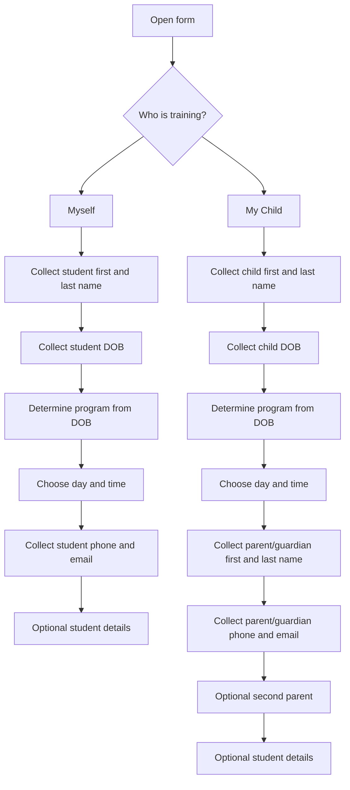

### 3.3 Proposed Identity Rule

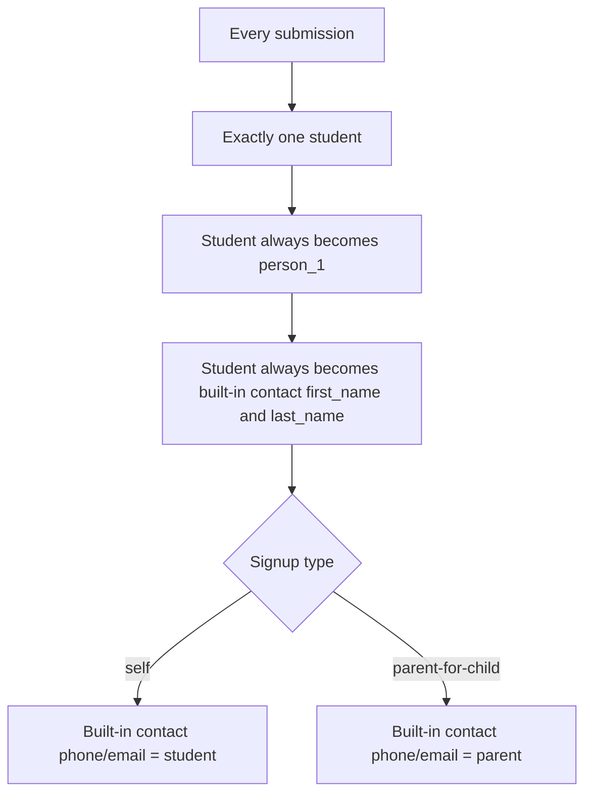

This is the simplest way to preserve:

- one student per booking
- current `person_1` appointment logic
- account named after the child when a parent is signing up

---

## 4. Proposed Data Model

### 4.1 Full Proposed Ownership

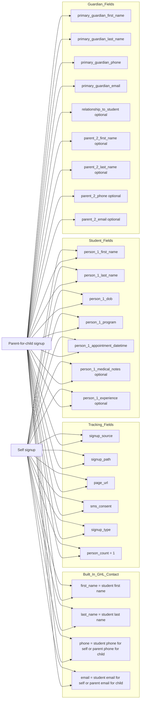

### 4.2 Why New Primary Guardian Fields Are Needed

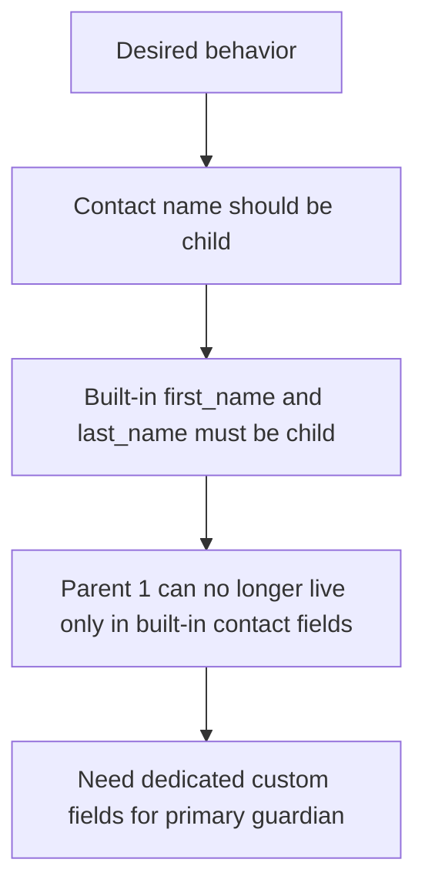

Without those fields, you would lose the parent's name when the child becomes the contact record name.

---

## 5. Proposed Webhook Payloads

### 5.1 Self Signup

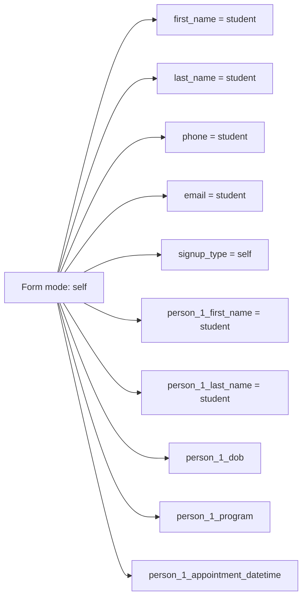

### 5.2 Parent-for-Child Signup

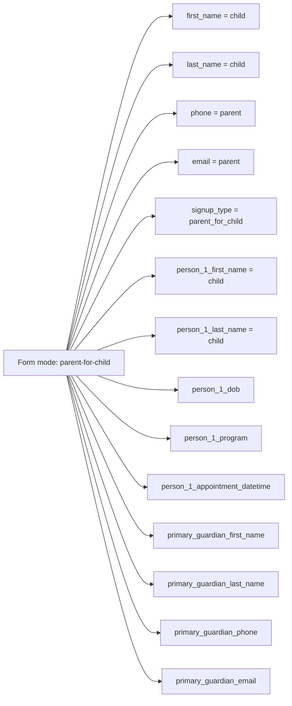

### 5.3 Proposed Field Matrix

| Field | Self | Parent-for-child |
|---|---|---|
| `first_name` | student | child |
| `last_name` | student | child |
| `phone` | student | parent |
| `email` | student | parent |
| `signup_type` | `self` | `parent_for_child` |
| `person_1_first_name` | student | child |
| `person_1_last_name` | student | child |
| `person_1_dob` | student | child |
| `person_1_program` | student | child |
| `person_1_appointment_datetime` | student | child |
| `primary_guardian_*` | blank | populated |
| `parent_2_*` | optional | optional |
| `person_count` | `1` | `1` |

---

## 6. Proposed GHL Workflow

### 6.1 Proposed Workflow Map

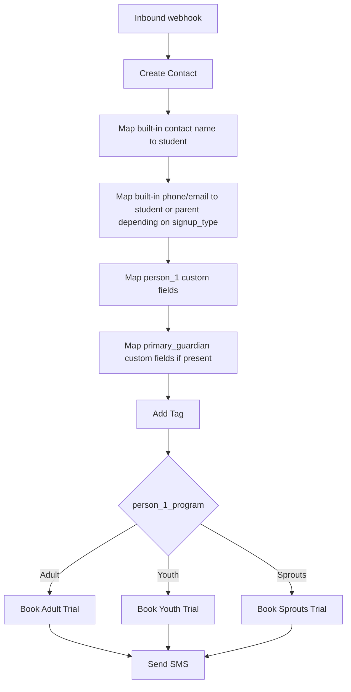

### 6.2 Proposed Workflow Sequence

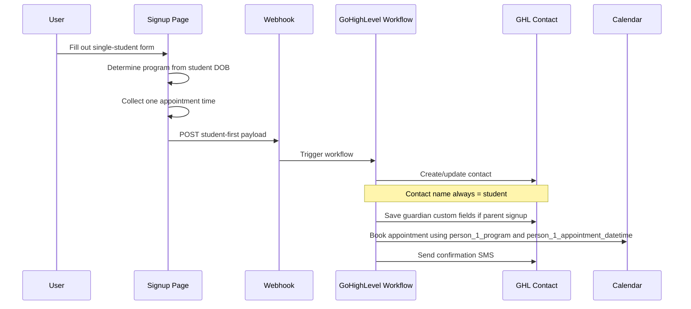

---

## 7. Exact Simplification You Want

This is the clean mental model.

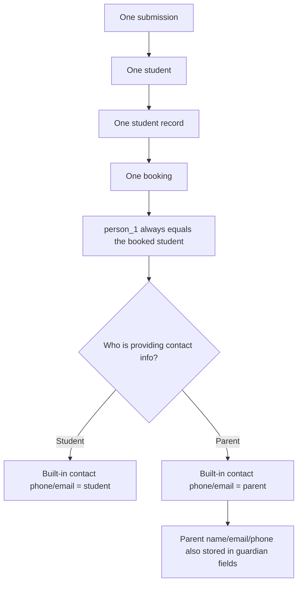

---

## 8. Concrete Page Changes

### 8.1 Both `/signup` and `/voice-signup`

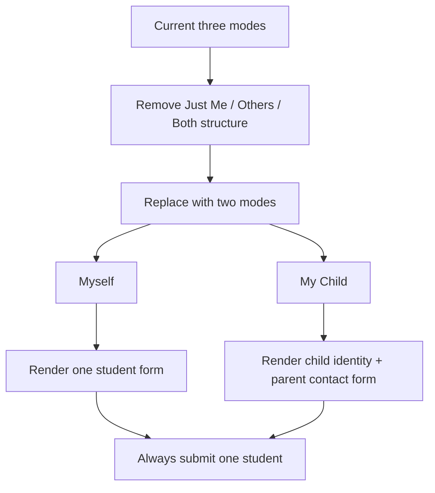

### 8.2 Field Cleanup

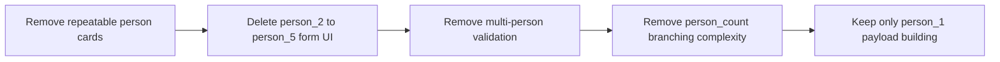

### 8.3 Voice Page Extras

If you keep voice-specific emergency contact fields, the single-student version becomes:

```mermaid
flowchart TD
    A[/voice-signup] --> B{Mode}
    B --> C[Myself]
    B --> D[My Child]

    C --> E[Student info]
    E --> F[Student emergency contact]
    F --> G[Submit one student]

    D --> H[Child info]
    H --> I[Parent contact info]
    I --> J[Emergency contact for child]
    J --> K[Submit one student]
```

---

## 9. Recommended Final Architecture

```mermaid
flowchart TD
    A[/signup] --> C[Shared single-student payload shape]
    B[/voice-signup] --> C

    C --> D[first_name / last_name always = student]
    C --> E[phone / email = student or parent depending on mode]
    C --> F[person_1_* always = student]
    C --> G[primary_guardian_* only when parent is signing up]
    C --> H[parent_2_* optional]

    D --> I[GoHighLevel Create Contact]
    E --> I
    F --> J[GoHighLevel Book Appointment]
    G --> I
    H --> I

    I --> K[Student-named contact record]
    J --> L[Correct calendar booking]
```

## 10. Bottom Line

The simplest correct model is:

- both pages use the same single-student flow
- remove all multi-person registration
- `person_1` is always the student being booked
- built-in contact `first_name` and `last_name` are always the student
- built-in contact `phone` and `email` come from the student for self-signup, or the parent for child-signup
- primary parent info needs dedicated custom fields, otherwise it gets lost

If you want, I can do the next artifact too:

1. a stripped-down implementation plan for both HTML files
2. a GHL custom-field checklist for the new guardian fields
3. a before/after payload example in raw JSON
